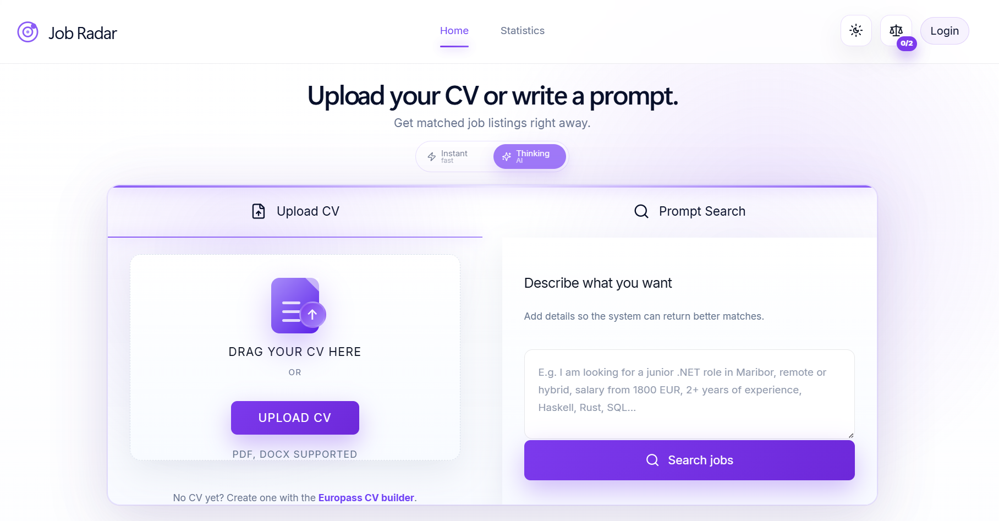
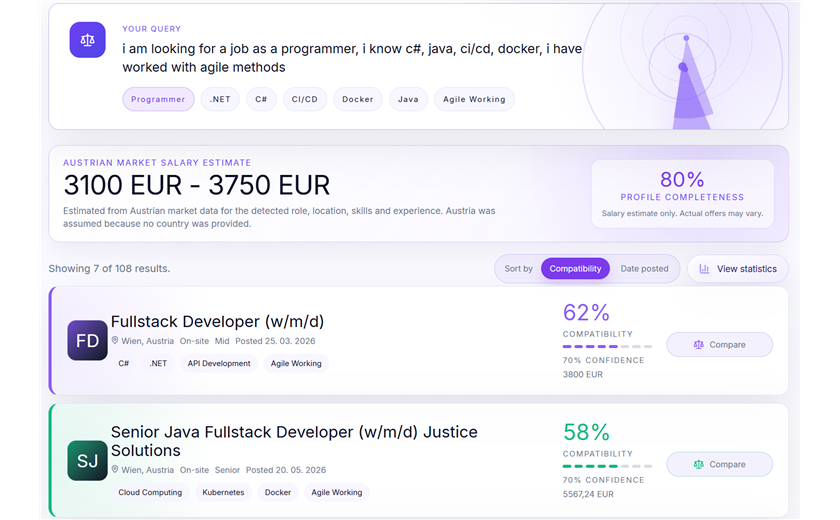
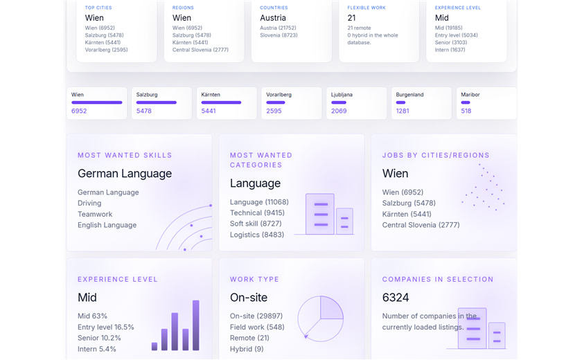
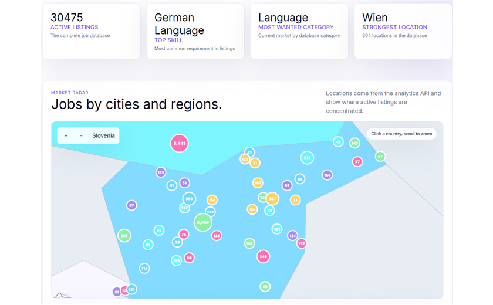
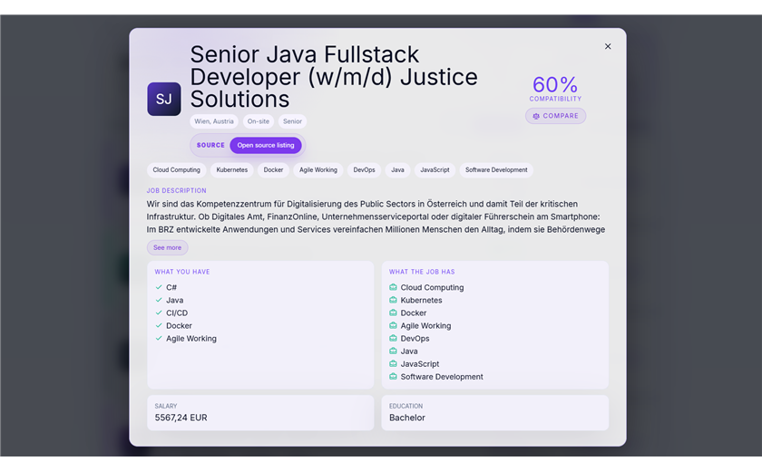
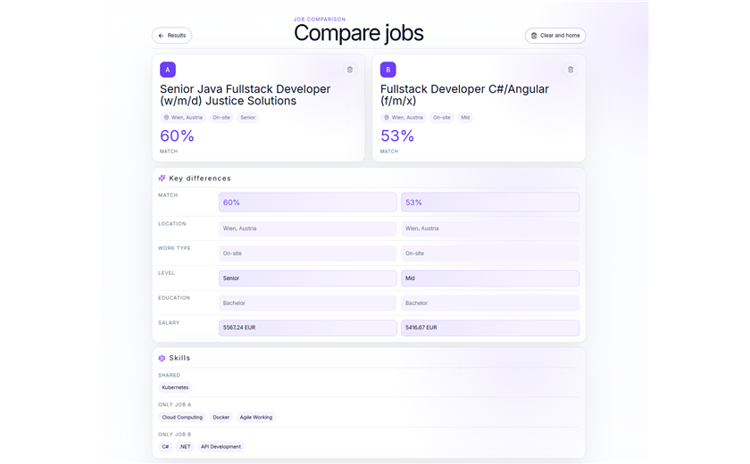
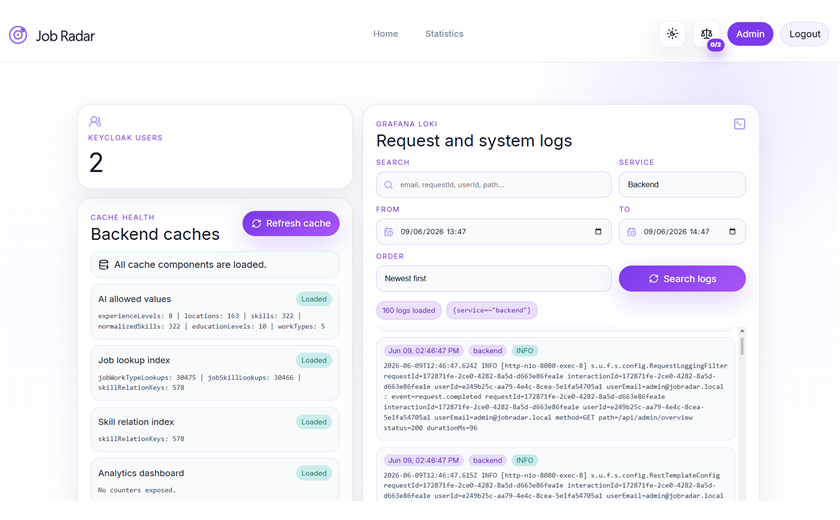
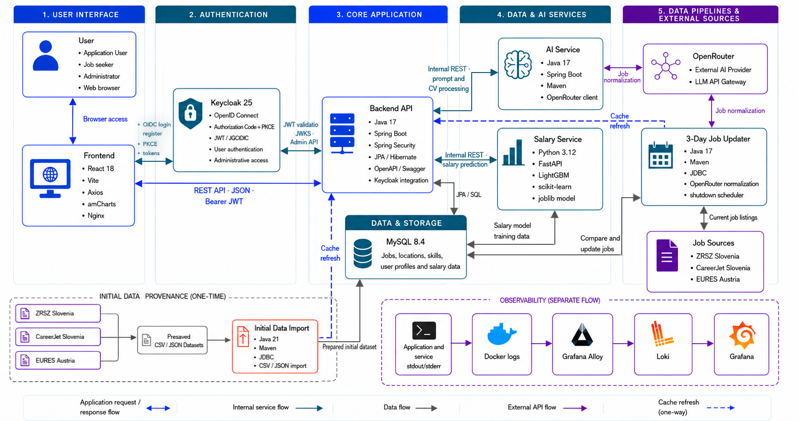

# Smart Job Platform


Smart Job Platform is a platform for labour market analysis, job search and salary range prediction.

Live application: [https://www.jobsearchwith.me](https://www.jobsearchwith.me)

The project addresses the problem of fragmented job listings: offers are published across different portals, countries and languages, often using inconsistent terms for the same skills and often missing clear salary information. The application collects and normalizes job data, makes listings comparable and helps users understand where opportunities are, which skills are in demand and what salary range they can expect.

## Vision

The goal is to turn scattered job market data into a clear, searchable and comparable overview. Instead of treating job listings as isolated ads, the platform connects roles, locations, skills, experience levels, CV data and salary expectations into one decision-support tool for candidates and market analysis.

## What we built

The application includes:

- job search and filtering;
- comparison of job listings from multiple sources;
- analytics dashboard for labour market overview;
- insights into top skills, roles, locations and experience levels;
- CV analysis and job suggestions based on candidate profile;
- salary range prediction based on role, location, experience and skills;

## Application gallery

Click any image to open it in full size.

<table>
  <tr>
    <td align="center" valign="top" colspan="3">
      <a href="docs/images/home-page.png">
        
      </a><br>
      <strong>Home page</strong>
    </td>
  </tr>
  <tr>
    <td align="center" valign="top" width="33%">
      <a href="docs/images/search-results.png">
        
      </a><br>
      <strong>Job search results</strong>
    </td>
    <td align="center" valign="top" width="33%">
      <a href="docs/images/statistics-overview.png">
        
      </a><br>
      <strong>Statistics overview</strong>
    </td>
    <td align="center" valign="top" width="33%">
      <a href="docs/images/statistics-map.png">
        
      </a><br>
      <strong>Statistics map</strong>
    </td>
  </tr>
  <tr>
    <td align="center" valign="top" width="33%">
      <a href="docs/images/job-details.png">
        
      </a><br>
      <strong>Job details</strong>
    </td>
    <td align="center" valign="top" width="33%">
      <a href="docs/images/job-comparison.png">
        
      </a><br>
      <strong>Job comparison</strong>
    </td>
    <td align="center" valign="top" width="33%">
      <a href="docs/images/admin-panel.png">
        
      </a><br>
      <strong>Administration panel</strong>
    </td>
  </tr>
</table>

## Data sources

Job listings are currently collected from:

- **ZRSZ** for Slovenia;
- **CareerJet** for Slovenia;
- **EURES** for Austria.

The collected listings are normalized into a common data model so they can be searched, compared and analyzed consistently.

## Target users

- **Job seekers** who want to find relevant listings faster.
- **Students and junior candidates** who want to understand which skills the market expects.
- **Career changers** who need to compare roles, locations and required knowledge.
- **Employers or analysts** who want an overview of labour market demand.

## Architecture



The platform consists of five main areas:

- **User Interface** - a React application for job search, CV matching, analytics and administration.
- **Authentication** - Keycloak manages registration, login and role-based access.
- **Core Application** - the Spring Boot backend handles business logic and stores platform data in MySQL.
- **Data & AI Services** - dedicated services process search prompts and CVs and predict salary ranges.
- **Data Pipelines & External Sources** - job listings are imported and updated from ZRSZ, CareerJet and EURES, with OpenRouter used for AI-assisted normalization.

## Quick start

The supported root-level setup uses Docker and starts the complete application stack.

### 1. Install prerequisites

Make sure you have:

- Git
- Docker
- Docker Compose

Make sure Docker Desktop or the Docker daemon is running before continuing.

### 2. Clone and enter the project

```powershell
git clone https://github.com/neSSHHa/Pametni-iskalec-zaposlitev-in-napovedovalec-pla-.git
cd Pametni-iskalec-zaposlitev-in-napovedovalec-pla-
```

If you already have the project locally, only enter the project root.

### 3. Prepare environment variables

From the project root, copy the example environment file:

```powershell
Copy-Item .env.example .env
```

On macOS/Linux:

```bash
cp .env.example .env
```

If you want AI features to work, set your API key in `.env`:

```env
OPENROUTER_API_KEY=your_api_key_here
```

You can create an OpenRouter key at [https://openrouter.ai](https://openrouter.ai). AI features such as natural-language extraction, CV processing and job normalization require this key.

`OPENROUTER_API_KEY` enables AI features in the application. 

`OPENROUTER_API_KEYS` is used only by the optional 3-day job updater.

Job normalization requires OpenRouter keys, which can be created at [openrouter.ai/settings/keys](https://openrouter.ai/settings/keys). With the free version and its request limits, a complete data update may take approximately three days.

Do not commit real API keys or passwords.

### 4. Start the application

```powershell
docker compose -f docker/docker-compose.yml up -d --build
```

This starts the frontend, backend, database, Keycloak, AI service and salary service. Keycloak provides login, registration and role-based access.

The first build may take several minutes. Check that all containers are running:

```bash
docker compose -f docker/docker-compose.yml ps
```

If a service does not start, inspect the logs:

```bash
docker compose -f docker/docker-compose.yml logs -f
```

### 5. Import the initial data and train the salary model

Run this step after the application stack is up. The importer requires the database and backend tables to be available.

On Windows:

```powershell
.\docker\import-data-and-train.ps1
```

On macOS/Linux:

```bash
# Build the initial data importer
docker compose -f docker/docker-compose.yml -f docker/docker-compose.dev.yml --profile import build data-importer

# Import the initial dataset into MySQL
docker compose -f docker/docker-compose.yml -f docker/docker-compose.dev.yml --profile import run --rm data-importer

# Train and save the salary prediction model
docker compose -f docker/docker-compose.yml -f docker/docker-compose.dev.yml --profile import run --rm --no-deps salary-trainer
```

The Windows script performs the same three steps automatically. The process fills the database with the initial dataset from `data-ingestion/` and trains the salary model used to predict salary ranges.

### 6. Open the application

- Application: [http://localhost:3000](http://localhost:3000)
- Backend API: [http://localhost:8080](http://localhost:8080)
- Swagger UI: [http://localhost:8080/swagger-ui/index.html](http://localhost:8080/swagger-ui/index.html)
- Keycloak: [http://localhost:8081](http://localhost:8081)

The recurring job updater is not started by the basic application command. See the [Job updater documentation](weekly-job-updater/README.md) when you want to refresh current listings.

Production logging is available through Grafana, Loki and Grafana Alloy. It is optional and documented separately in [Production logging](docs/production-logging.md).

### 7. Stop the application

```powershell
docker compose -f docker/docker-compose.yml down
```

To also remove local database data and saved models:

```powershell
docker compose -f docker/docker-compose.yml down -v
```

Warning: `down -v` permanently removes the imported database data and trained salary model.

## Further documentation

The root README only covers the project overview and Docker setup. Development commands, service configuration and implementation details belong in the module documentation:

- [Frontend documentation](frontend/README.md)
- [Backend documentation](backend/README.md)
- [AI service documentation](ai-service/README.md)
- [Salary service documentation](salary-service/README.md)
- [Data ingestion documentation](data-ingestion/README.md)
- [Job updater documentation](weekly-job-updater/README.md)
- [Test documentation](docs/test-documentation.md)
- [Production logging with Grafana, Loki and Alloy](docs/production-logging.md)
- [Database documentation](docs/database-documentation.md)
