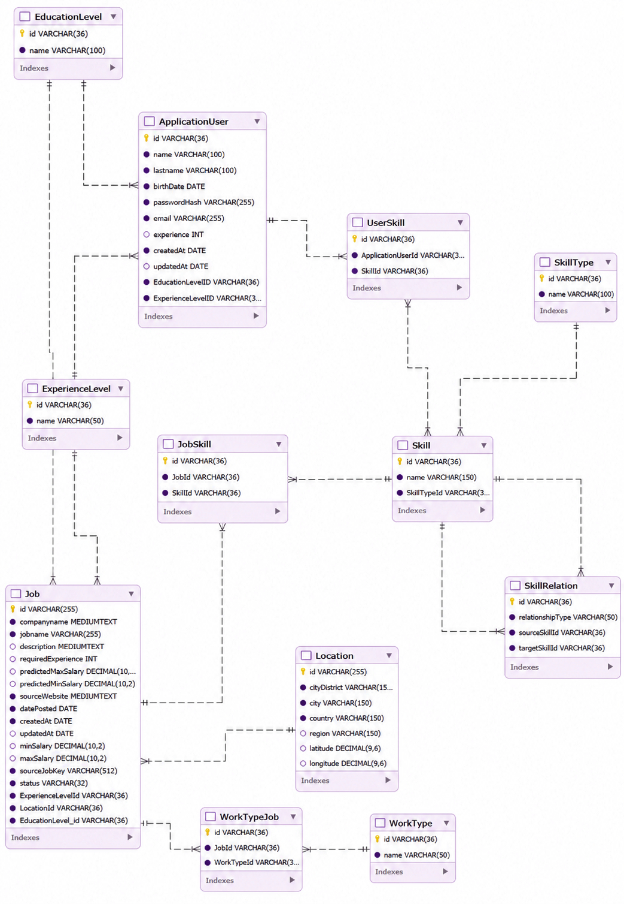

# Database Documentation

## Database Model

Job Radar uses a relational MySQL 8.4 database to store job listings, locations, skills, salary information, and user profiles.

The model connects jobs with their required skills, work arrangements, experience levels, education levels, and locations. User profiles store candidate skills and experience, enabling job matching and personalized analysis.

## Entity-Relationship Diagram

